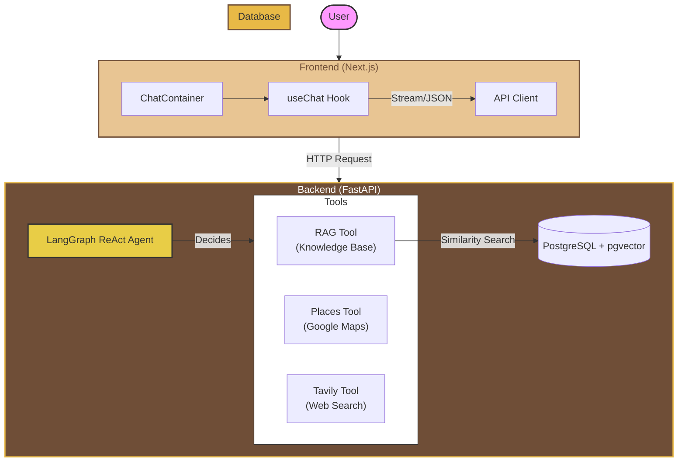
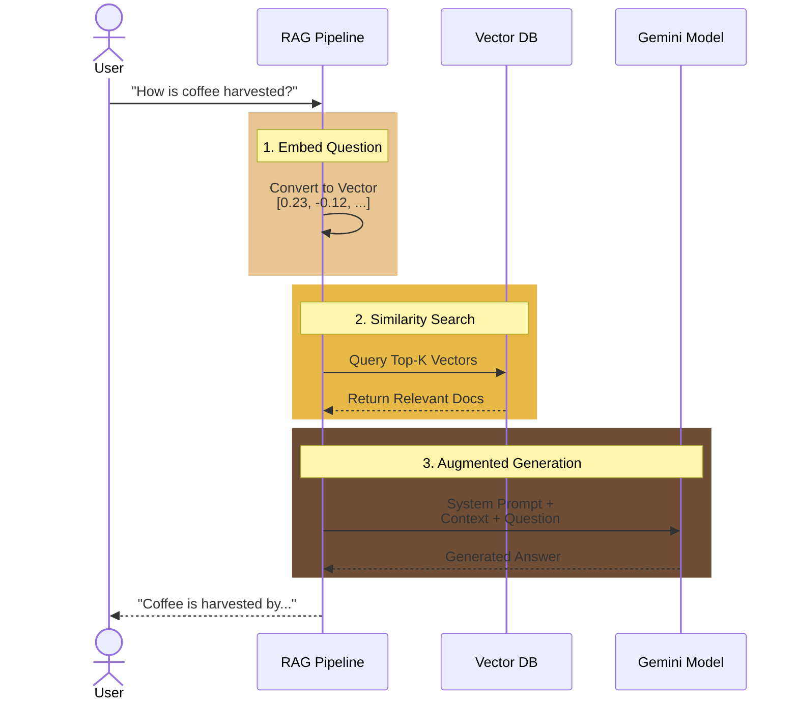
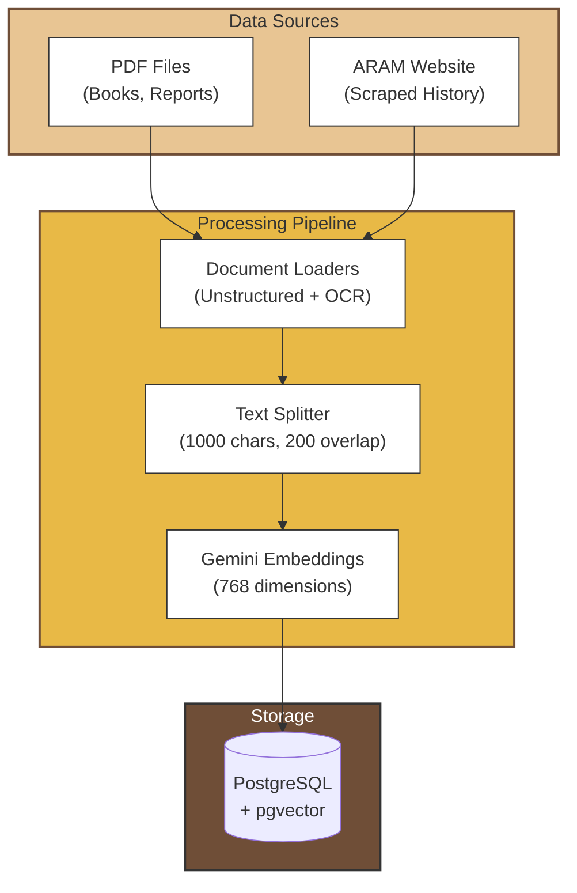

# ☕ Brazilian Coffee Chatbot

An AI-powered chatbot that answers questions about Brazilian coffee — from its rich history to brewing methods, from plantation techniques to finding the best coffee shops near you.

Built with **RAG (Retrieval-Augmented Generation)** architecture using LangChain, Gemini, and PostgreSQL with pgvector.


---

## 📋 Table of Contents

- [Features](#-features)
- [Architecture](#-architecture)
- [RAG Deep Dive](#-rag-deep-dive)
- [Tech Stack & Decisions](#-tech-stack--decisions)
- [Project Structure](#-project-structure)
- [Setup](#-setup)
- [Usage](#-usage)
- [API Reference](#-api-reference)

---

## ✨ Features

- **Educational Q&A**: Answer questions about coffee history, cultivation, harvesting, roasting, and brewing
- **Coffee Classification**: Explain quality levels and specialty coffee standards
- **Location Search**: Find coffee shops in any city using Google Places API
- **Web Search Fallback**: Search the web when local knowledge isn't enough
- **Multilingual**: Responds in the same language the user writes (Portuguese, English, etc.)
- **Real-time Streaming**: See responses appear word-by-word like ChatGPT
- **MLOps Ready**: LangSmith integration for tracing and monitoring

---

## 🏗 Architecture



### Component Responsibilities

| Component | Responsibility |
|-----------|---------------|
| **Next.js Frontend** | Chat UI with streaming support, coffee-themed design |
| **FastAPI Backend** | REST API, request handling, CORS |
| **LangGraph Agent** | Decision-making: which tool to use based on user intent |
| **RAG Tool** | Search knowledge base for coffee information |
| **Places Tool** | Find coffee shops via Google Places API |
| **Tavily Tool** | Web search for current/missing information |
| **PostgreSQL + pgvector** | Store document embeddings for similarity search |

---

## 🔍 RAG Deep Dive

### What is RAG?

**RAG (Retrieval-Augmented Generation)** combines:
1. **Retrieval**: Find relevant documents from a knowledge base
2. **Augmented**: Add those documents to the LLM prompt
3. **Generation**: LLM generates answer using the context



### Why RAG Instead of Fine-tuning?

| Approach | Pros | Cons |
|----------|------|------|
| **Fine-tuning** | Knowledge baked into model | Expensive, outdated quickly, hallucinations |
| **RAG** | Up-to-date, verifiable sources, cheaper | Requires vector DB, retrieval latency |

**We chose RAG because:**
1. Coffee information can be updated without retraining
2. Responses can cite sources
3. No expensive GPU training required
4. Works with any LLM (Gemini, GPT, Claude)

### Ingestion Pipeline



### Why These Chunking Parameters?

```python
chunk_size=1000    # ~250 tokens, fits well in context
chunk_overlap=200  # Preserves context at boundaries
```

- **Too small** (100 chars): Loses context, fragments sentences
- **Too large** (5000 chars): Retrieves irrelevant content, wastes tokens
- **1000 chars**: Good balance for Q&A retrieval

---

## 🛠 Tech Stack & Decisions

### LLM: Gemini 3 Pro

**Why Gemini?**
- Excellent multilingual support (Portuguese/English)
- Competitive pricing
- Good reasoning for tool selection
- Native streaming support

### Vector DB: PostgreSQL + pgvector

**Why pgvector over Pinecone/Chroma?**
- **Self-hosted**: No vendor lock-in, data stays local
- **SQL familiar**: Easy to query, backup, maintain
- **Production-ready**: PostgreSQL is battle-tested
- **Free**: No per-query costs

### PDF Processing: Unstructured + Tesseract

**Why Unstructured?**
- Handles mixed content (text + images + tables)
- OCR support for scanned documents
- Preserves document structure
- Portuguese language support

### Agent Framework: LangGraph

**Why LangGraph over LangChain Agents?**
- Better streaming support
- More control over agent flow
- Production-ready state management
- Easier debugging with LangSmith

### Frontend: Next.js + Tailwind

**Why Next.js?**
- React with built-in optimizations
- Easy deployment (Vercel)
- TypeScript support
- Fast development

---

## 📁 Project Structure

```
brazilian-coffee-chatbot/
├── backend/
│   ├── app/
│   │   ├── agents/
│   │   │   └── coffee_agent.py    # LangGraph ReAct agent
│   │   ├── db/
│   │   │   └── vector_store.py    # pgvector connection
│   │   ├── ingestion/
│   │   │   ├── pdf_loader.py      # PDF processing with OCR
│   │   │   ├── web_scraper.py     # ARAM website scraper
│   │   │   └── embedder.py        # Embedding pipeline
│   │   ├── tools/
│   │   │   ├── rag_tool.py        # Knowledge base search
│   │   │   ├── places_tool.py     # Google Places API
│   │   │   └── search_tool.py     # Tavily web search
│   │   ├── main.py                # FastAPI application
│   │   └── settings.py            # Environment config
│   ├── pdfs/                      # Knowledge base PDFs
│   ├── docker-compose.yml         # PostgreSQL + pgvector
│   └── requirements.txt
├── frontend/
│   ├── src/
│   │   ├── app/                   # Next.js App Router
│   │   ├── components/Chat/       # Chat UI components
│   │   ├── hooks/useChat.ts       # Streaming chat hook
│   │   └── lib/api.ts             # Backend API client
│   └── tailwind.config.ts         # Coffee color theme
└── docs/
    └── ARCHITECTURE.md            # Technical deep dive
```

---

## 🚀 Setup

### Prerequisites

- Python 3.11+
- Node.js 18+
- Docker (for PostgreSQL)
- Tesseract OCR (`brew install tesseract` on macOS)

### 1. Clone & Environment

```bash
git clone <repo-url>
cd brazilian-coffee-chatbot

# Backend
cd backend
cp .env.example .env
# Fill in your API keys in .env
```

### 2. Environment Variables

```env
# Required
GOOGLE_API_KEY=your-gemini-api-key

# Optional (for full features)
TAVILY_API_KEY=your-tavily-key
GPLACES_API_KEY=your-google-places-key
LANGSMITH_API_KEY=your-langsmith-key
```

### 3. Start Database

```bash
cd backend
docker-compose up -d
```

### 4. Install & Run Backend

```bash
cd backend
pip install -r requirements.txt

# Optional: Download additional PDFs to backend/pdfs/
# Example: wget https://fundar.org.br/wp-content/uploads/2021/06/pequena-historia-do-cafe-no-brasil.pdf -O backend/pdfs/pequena-historia-do-cafe-no-brasil.pdf

# Ingest documents (one-time)
python -m app.ingestion.embedder

# Start server
python -m app.main
```

**💡 Tip**: You can add more PDFs to `backend/pdfs/` before running ingestion. For example, download [Pequena História do Café no Brasil](https://fundar.org.br/wp-content/uploads/2021/06/pequena-historia-do-cafe-no-brasil.pdf) to expand your knowledge base.

### 5. Install & Run Frontend

```bash
cd frontend
npm install
npm run dev
```

Open http://localhost:3000

---

## 📖 Usage

### Chat Examples

| Question | Tool Used |
|----------|-----------|
| "Como o café chegou ao Brasil?" | RAG (knowledge base) |
| "What are the best brewing methods?" | RAG (knowledge base) |
| "Onde posso tomar café em São Paulo?" | Google Places |
| "What's the current coffee price in 2025?" | Tavily (web search) |

### CLI: Ingest Documents

```bash
cd backend
python -m app.ingestion.embedder
```

### CLI: Test Web Scraper

```bash
cd backend
python -c "
from app.ingestion.web_scraper import scrape_aram_history_sync
docs = scrape_aram_history_sync()
print(f'Scraped {len(docs)} documents')
"
```

---

## 📚 API Reference

### POST /chat

Non-streaming chat response.

```bash
curl -X POST http://localhost:8000/chat \
  -H "Content-Type: application/json" \
  -d '{"message": "How to brew coffee?", "history": []}'
```

**Response:**
```json
{
  "response": "There are several popular brewing methods..."
}
```

### POST /chat/stream

Streaming chat response (Server-Sent Events).

```bash
curl -X POST http://localhost:8000/chat/stream \
  -H "Content-Type: application/json" \
  -d '{"message": "How to brew coffee?", "history": []}'
```

**Response:** Plain text stream

---

## 🔮 Future Improvements

- **Cloud Storage Integration**: Use Google Drive, S3, or other cloud storage to maintain PDFs instead of storing them locally. This would enable dynamic document updates without redeployment and better scalability.

---

## 📄 License

MIT License - See [LICENSE](LICENSE) for details.

---

## 🙏 Acknowledgments

- Coffee PDFs sourced from Brazilian agricultural research institutions
- [ARAM Brasil](https://arambrasil.coffee) for coffee history content
- Built with [LangChain](https://langchain.com) and [LangGraph](https://langchain-ai.github.io/langgraph/)
